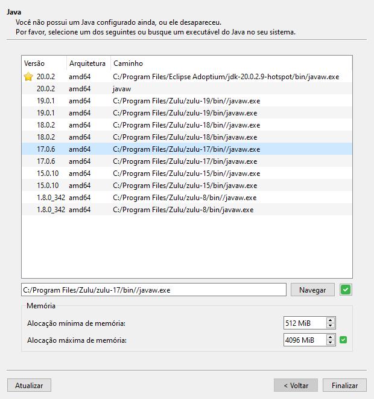
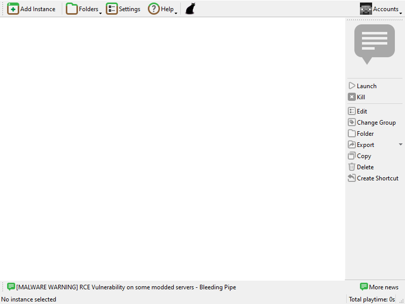
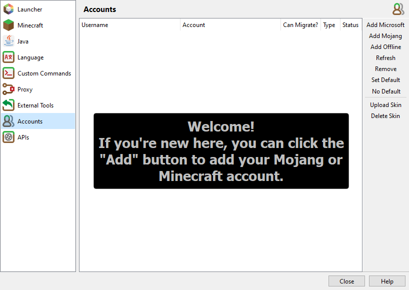

import { Card, LinkCard, CardGrid } from '@astrojs/starlight/components';

## Java

A versão do modpack é a 1.20.1, então é necessário a instalação do Java 17.

<LinkCard 
	description='Download Java 17 (OpenJDK)' 
	title='Se você não tiver o Java 17'
	target="_blank"
	href='https://www.azul.com/core-post-download/?endpoint=zulu&uuid=08f858d1-a34b-4b40-95a9-b9ad1bf5d5dd'/>
	
## Launcher

Para jogar, é necessário um launcher com suporte a importar .zip's.

Eu recomendo o Prism Laucher por não só poder importar .zip's, mas tambem é capaz de:
- Separar o jogo por instancias isoladas, evitando de misturar mods e mundos.
- Baixar modpacks de plataformas como CurseForge, Technic, Modrinth e outros.
- Baixar mods, texturas e shaders direto do launcher.

<CardGrid>
	<LinkCard title='Original' target="_blank" href='https://prismlauncher.org/download/'/>
	<LinkCard title='Offline'  target="_blank" href='https://github.com/Diegiwg/PrismLauncher-Cracked/releases/download/7.1/PrismLauncher-Windows-MinGW-w64-Portable-7.1.zip'/>
</CardGrid>

### Configuração

Ao inciar o launcher, será preciso escolher a linguagem da interface e configurações do Java.

Neste tutorial iremos usar termos em inglês, mas o launcher tem pleno suporte ao português.

Na configuração do Java, será listado todas as versões instaladas e encontradas, selecione o que começa com 17

### Memoria RAM

Dependendo da quantidade de RAM no seu sistema, quantidades diferentes devem ser alocadas.

Não recomendo tentar com menos de 6GB de RAM instalada no sistema.

| RAM do Sistema | 6GB | 8GB | Mais que 8GB |
| ----------- | ----------- | ----------- | ----------- |
| Campo 1 | 512MiB | 2048MiB | 6144MiB |
| Campo 2 | 4096MiB | 6144 MiB | 6144MiB |

Para computadores com com bastante RAM, eu não recomendo alocar mais do que 10240MiB (10GB+-) visto que pode piorar a performance do jogo!

### Conta

import { Tabs, TabItem } from '@astrojs/starlight/components';

Ao terminar, você sera deixado nessas tela:

Agora e necessário configurar sua conta

No canto superior direito escolha "Accounts" e então 'Manage Accounts'

#### Siga os passos apropriados:

<Tabs>
	<TabItem label="Original">
		Escolha "Add Microsoft" e siga as instruções na tela, ao final sua conta estará atrelada!
	</TabItem>
	<TabItem label="Offline">
	 	Escolha "Add Offline" e escolha seu nick, é importante que você não se arrependa desse nick, se você muda-ló, perdera seus items!
	</TabItem>
</Tabs>

## Importando o .zip

:::note[Nota sobre o .zip]
Por varios motivos, não tem um link permanente de download do modpack, pergunte ao Kaio pelo link
::: 

Ao baixar o .zip, não o extraia. 
- Abra o launcher e escolha "Add Instance" e então "Import from .zip". 
- Escolha o arquivo e clique em OK

## Conclusão

Se tudo deu certo, basta dar dois cliques na instancia e o jogo sera iniciado! Divirta-se!

