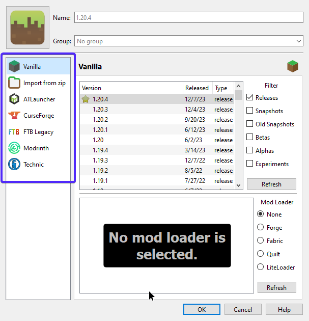
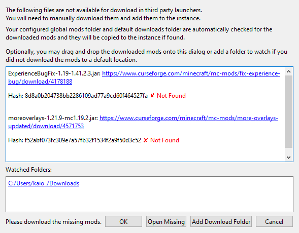

## Encontrando Modpacks

No PrismLauncher, escolha "Add Instance" e tera varias opções de repositorio

As mais importantes são

- CurseForge: O repositorio mais popular no momento
- Modrinth: Um repositorio novo que esta crescendo rapido
- ATlauncher: Um repositio já antigo, só tem umas coisas mais nichadas
- TecnhicLauncher: Um classico, pouco usado hoje em dia

As outras opções não seram muito discutidas aqui.

Ao clicar em qualquer dessas opções, você podera buscar modpacks, só excolher um dar OK, o launcher ira baixar e configurar tudo automaticamente

:::danger[Sobre mods faltando]
Por varios motivos, nem todos os mods podem ser baixados direto do launcher, veja como resolver a seguir
::: 

## Resolvendo mods faltando

Quando o laucher não consegue baixar um mod, ele ira tentar resolver da seguinte maneira

Nesse popup, os mods faltando são listados, junto de seus possiveis links, você pode clicar em cada um baixar manualmente, ou clicar "Open Missing" no canto inferior, isso ira abrir seu browser onde ele baixara os mods, **acesse cada guia que for aberta, só para garantir que o download seja iniciado**.

O PrismLauncher tentara achar os arquivos na sua pasta de downloads, mas talvez seus donwloads não fiquem no caminho padrão do windows. Você pode adicionar pastas de download manualmente usando "Add Download Folder"

Se o launcher detectar os mods, ele avisara na mesma janela.

## Conclusão

Se tudo deu certo, basta dar dois cliques na instancia e o jogo sera iniciado! Divirta-se!